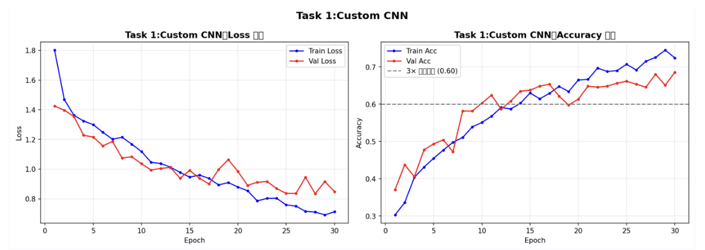
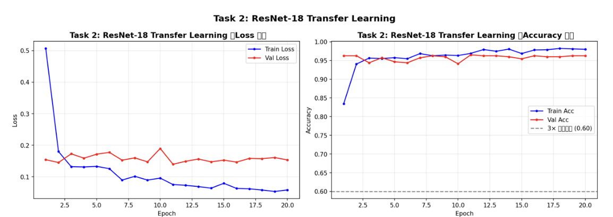
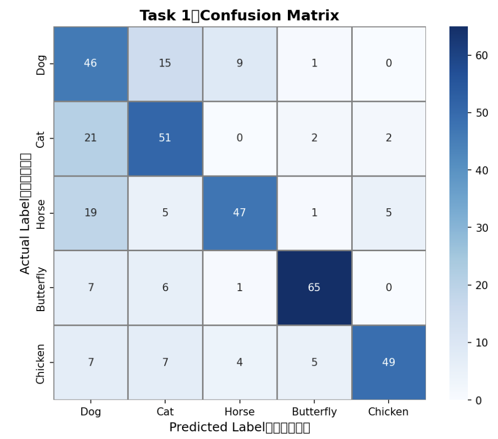
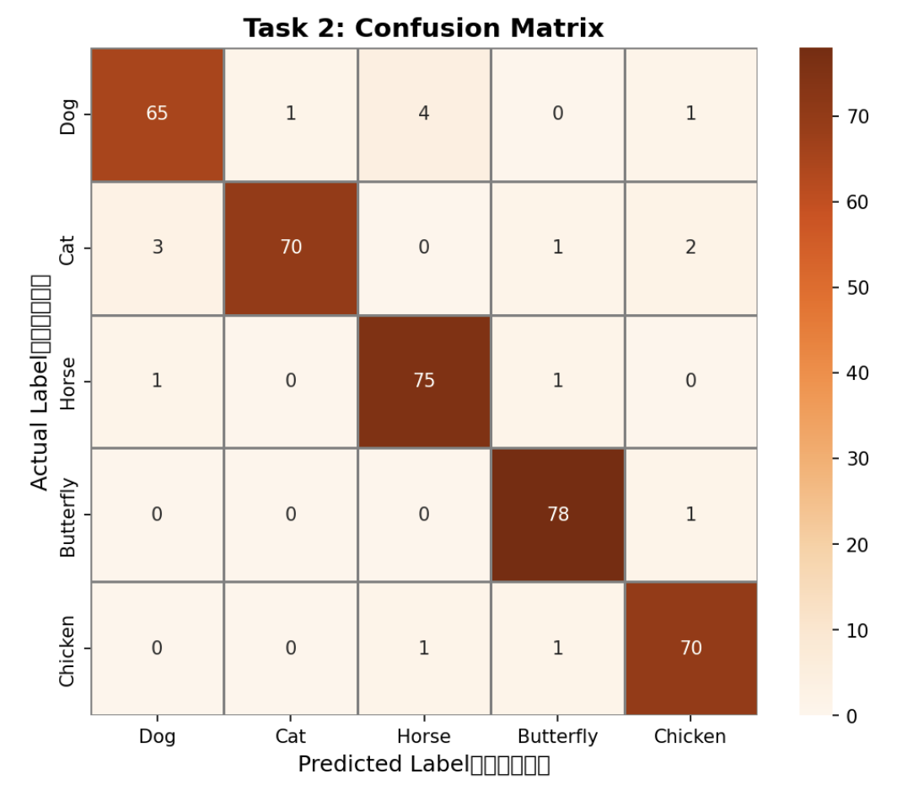

# Kaggle 影像分類實務與架構對比研究 🐾

PyTorch 深度學習課程作業，使用 Kaggle 動物影像資料集，對比自定義 CNN（From Scratch）與 ResNet-18 遷移學習（Transfer Learning）的分類效能差異。

---

## 實驗結果

### 訓練曲線

**任務一：Custom CNN**



**任務二：ResNet-18 Transfer Learning**



### 混淆矩陣

**任務一：Custom CNN**



**任務二：ResNet-18**



---

## 資料集

- **來源**：Kaggle 動物影像分類資料集
- **類別**：Dog、Cat、Horse、Butterfly、Chicken（共 5 類）
- **樣本數**：每類 500 張，總計 2,500 張
- **資料平衡**：各類別佔比均為 20%，完全平衡

---

## 模型對比

| 評估指標 | 任務一（Custom CNN） | 任務二（ResNet-18） |
|---------|---------------------|-------------------|
| 模型參數量 | 6,878,725（~6.8M） | 11,309,125（~11.3M） |
| 訓練耗時 | 506.5 s | 264.4 s |
| 準確率（Accuracy） | 68.53% | 97.07% |
| 精確率（Precision） | 0.6833 | 0.9709 |
| 召回率（Recall） | 0.6819 | 0.9695 |
| F1-Score | 0.6825 | 0.9697 |

**關鍵發現：**
- 任務二的訓練耗時僅約任務一的一半，因為凍結預訓練權重大幅減少了梯度計算量
- ResNet-18 將 Cat→Dog 的誤判次數從 21 次降至 3 次，驗證了預訓練特徵提取能力的優勢
- 任務一 Accuracy 達 68.53%，成功超越 5 類隨機猜測的 3 倍門檻（20% × 3 = 60%）

---

## 技術實作

### 任務一：Custom CNN（From Scratch）

- 手動設計 3 層卷積層（Conv2d + ReLU + MaxPool）
- 加入 Dropout（比率 0.5）防止過擬合
- 模型參數量控制在 15M 以內
- 手動編寫 Training Loop（梯度清零、反向傳播、優化器更新）

### 任務二：ResNet-18 Transfer Learning

- 從 `torchvision.models` 載入 ImageNet 預訓練權重
- 替換最後一層 FC 層，輸出維度改為 5（對應類別數）
- 凍結所有卷積層，僅訓練分類頭

### 資料前處理與增強

```python
transforms.RandomHorizontalFlip()
transforms.RandomCrop(224)
transforms.Normalize(mean=[0.485, 0.456, 0.406],
                     std=[0.229, 0.224, 0.225])  # ImageNet 標準化
```

---

## 錯誤分析

最易混淆類別：**Cat → Dog（誤判為狗）**

誤判原因分析：
1. **背景干擾**：CNN 模型易將草地等背景誤認為分類特徵
2. **毛髮輪廓相似**：長毛貓與小型長毛犬輪廓高度相似
3. **光影干擾**：強烈光影遮蔽貓科特有的鬍鬚與瞳孔形狀
4. **特徵提取能力不足**：淺層 CNN 難以捕捉細微解剖學差異

---

## 環境需求

```
Python 3.x
PyTorch
torchvision
scikit-learn
matplotlib
seaborn
```

---

## 如何執行

```bash
# 安裝依賴
pip install torch torchvision scikit-learn matplotlib seaborn

# 開啟 Jupyter Notebook
jupyter notebook pytorch_dl_hw1_B2209131.ipynb
```

---

## 學習成果

- 從零手刻 CNN 架構，理解卷積層、池化層、Dropout 的設計與調優
- 實作完整 Training Loop，掌握梯度清零、反向傳播、優化器更新流程
- 比較 From Scratch 與 Transfer Learning 在小規模資料集上的效能差異
- 透過混淆矩陣與錯誤分析，理解模型誤判的視覺特徵原因
